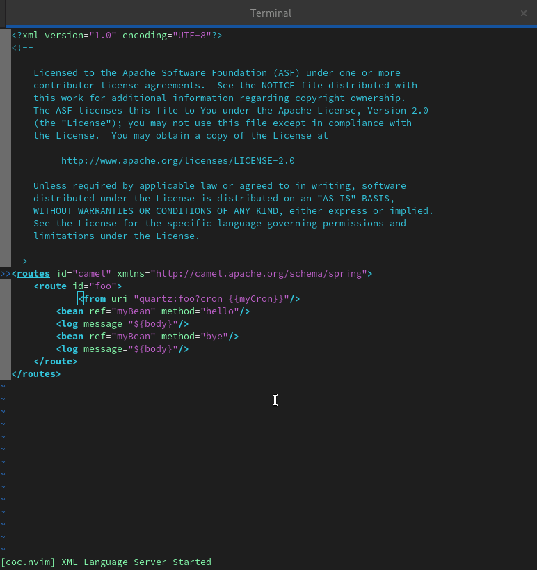
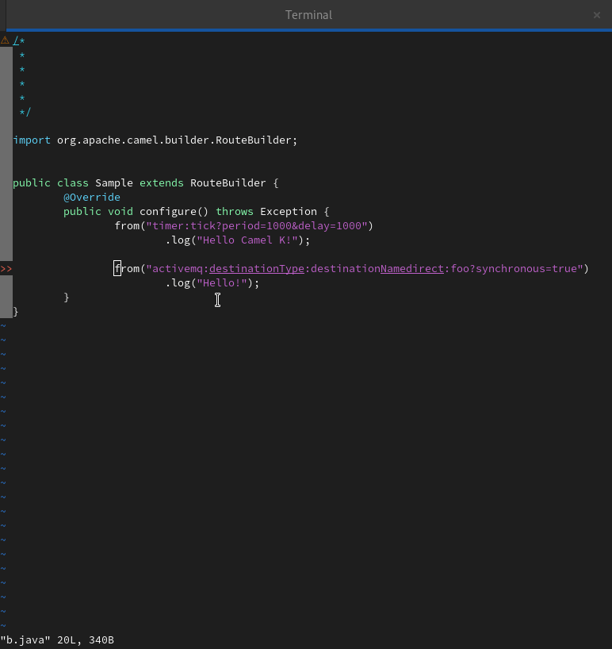

# Camel LS for Vim and Neovim  

This is short instructions for how to integrate Camel LS with Vim editor using coc.nvim (https://github.com/camel-tooling/camel-language-server).

# Text Editing capabilities of Camel XML using coc.nvim



# Text Editing capabilities of Camel URI with Camel JAVA using coc.nvim



## Prerequisites

Add this plugin in your `.vimrc` or `init.vim`
```
Plug 'neoclide/coc.nvim', {'branch': 'release'}
```

# Install Camel LS to Vim and Neovim using Neoclide coc.nvim LSP Client 

### In a `.vimrc` file:
```
" Initialize plugin system
  "
  call plug#begin()
  
  " Shorthand notation; fetches https://github.com/neoclide/coc.nvim
  Plug 'neoclide/coc.nvim', {'branch': 'release'}
  
  call plug#end()
```

### In a `CocConfig` file:
```
 {
    "languageserver": {
          "camel": {
                "command": "java",
                "args": ["-jar", "/home/npr/Downloads/camel-lsp-server-1.5.0.jar"],
                "filetypes": ["xml", "java", "camel"],
               "trace.server": "verbose"
          }
    }
}
```
Opening the `:CocConfig` file

Evaluating it by calling `:CocList services` to check the running services and also please refer this document to debug further - https://github.com/neoclide/coc.nvim/wiki/Debug-language-server.


